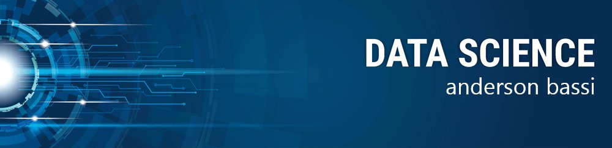

# Data-Science-Projects
My data science and analyzes projects 

   

  

# Anderson Bassi
*Mechanical Reliability Engineer* at Vale S/A / 
*Engenheiro de Confiabilidade Mecânica* na Vale S/A

As an experienced Mechanical Engineer and Data Scientist I combine analytical skills, ability to work in team environments, and attention to details. I have been  applying Data Science tools to real problems in iron ore beneficiation plants. I developed critical thinking and problem-solving skills.

My credentials include a Master's degree in engineering from Federal Universaty of São João del-Rei (UFSJ), and over 10 years of experience in the iron ore industry.

**Background in:** Python, Reliability-Centric Maintenance and Project Planning.

**Links:**
* [LinkedIn](https://www.linkedin.com/in/anderson-bassi-)

## Projetos:

* **Analisando dados do Airbnb para a cidade de Bolonha - ITA:** http://encr.pw/iRRTP

---
